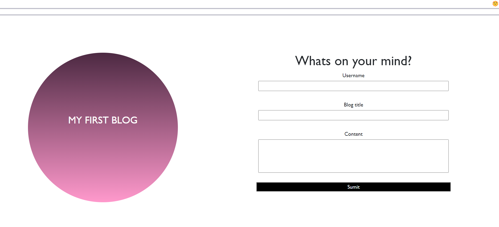
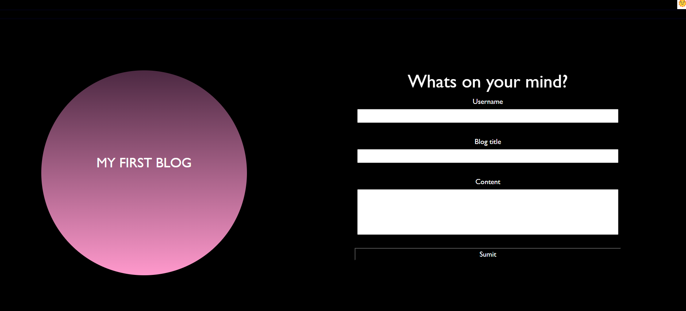
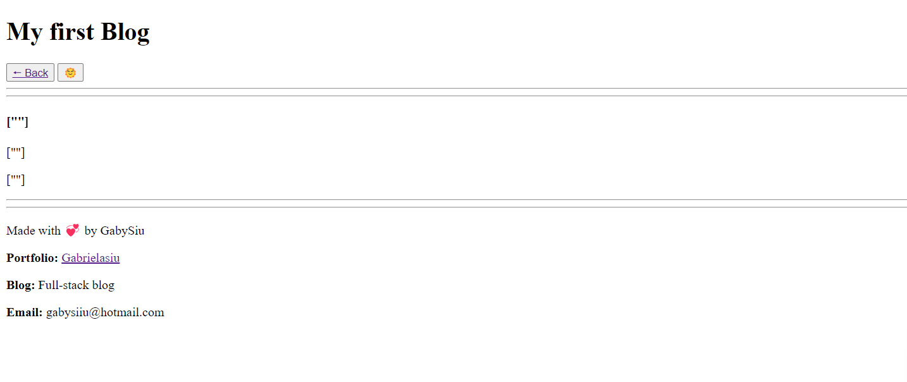

# My-Personal-Blog

##DESCRIPTION 
My first blog is an interactive website where users would be able to add their entries, user name, and contents. Once the information had been added, then they'll be able to check the console and see the entries in the localstorage. Once they do that, theyll be re-directed to the posts websites where theyll be able to see their post. 
For this website, I applied basic knowledge in JavaScript, such as for loop, while loop, I created variables, constants, arrays and used different functions such a creatElement and fuction to change to dark mode!. This is how my blog and form looks like!

